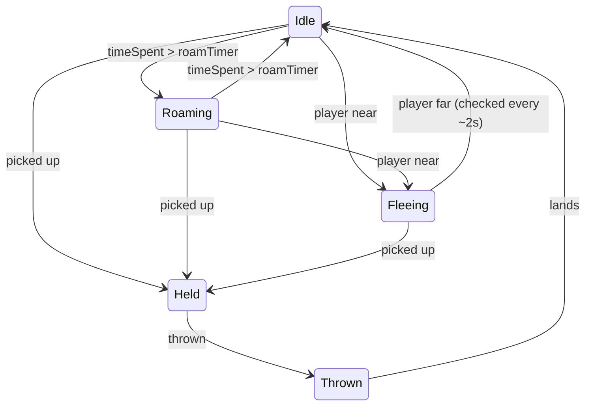

# Animal AI

Each animal is driven by a small per-instance state machine that decides whether it idles, wanders, flees, is carried, or is in flight.

## Why
Cornering animals is half the game.
Without autonomous movement and fleeing, pickup becomes trivial and the stacking rule loses its tension.

## How it works
`MovementSM` extends the generic `StateMachine`, builds one instance of each state in `Awake`, and starts in `Idle`.
`StateMachine` forwards `Update` to `UpdateLogic`, `LateUpdate` to `UpdatePhysics`, and tracks `timeSpent` in the current state (reset on every transition).

- **Idle**: stands still.
- **Roaming**: picks a random heading on `Enter` and walks it.
- **Fleeing**: moves directly away from the player.
- **Held**: collider off; `PickUp` parents and positions it (see [carry and throw](carry-and-throw.md)).
- **Thrown**: flies a fixed arc to the cursor, then returns to Idle.

`AnimalBaseState` is the shared base: it exposes the cached player transform, `AwayFromPlayer`, `PlayerIsNear` and `MoveAlong`, so states hold no lookup or distance code of their own.

Per-species tuning (`speed`, `weight`, `roamTimer`) is serialized on each prefab in `Assets/Prefabs/`.
`fleeThreshold` uses the script default.

## Key files

- `Assets/Scripts/GUIScripts/StateMachine.cs` - generic state machine and `timeSpent` clock
- `Assets/Scripts/AnimalScripts/BaseState.cs` - state hook interface
- `Assets/Scripts/AnimalScripts/AnimalBaseState.cs` - shared player-distance and movement helpers
- `Assets/Scripts/AnimalScripts/MovementSM.cs` - per-animal machine, tuning fields, pen `id`
- `Assets/Scripts/AnimalScripts/{Idle,Roaming,Fleeing,Held,Thrown}.cs` - the states

## Decisions and gotchas

- The player is found once per animal in `MovementSM.Awake` by the `Player` tag; every state reads that cache instead of calling `FindWithTag` per frame.
  An animal spawned before the player exists never finds it and will not flee.
- `fleeThreshold` is a **squared** distance (default 25, i.e. 5 units), compared against `sqrMagnitude` to avoid a square root per animal per frame.
- `roamTimer` is jittered by 0.75x-1.5x in `Awake` so a herd does not switch states in lockstep.
- Fleeing re-checks with `timeSpent % 2 < 0.1`, which depends on a frame landing in that window; at very low frame rates the check can be skipped for a cycle.
- `StateMachine` lives in `GUIScripts/` for historical reasons; it is generic, not GUI-specific.
- Movement uses `Rigidbody2D.MovePosition` in `UpdateLogic` (i.e. `Update`), not `FixedUpdate`; preserved from the original to keep the feel unchanged.

## Related

- [Carry and throw](carry-and-throw.md)
- [Level flow](level-flow.md)
