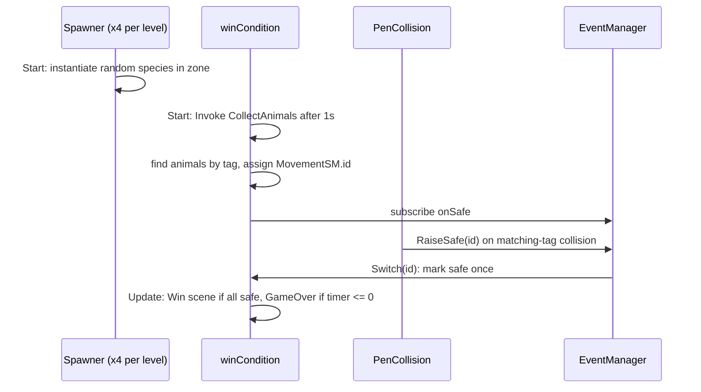

# Level flow

How a level spawns its herd, scores penned animals, ends in a win or loss, and how scenes connect.

## Why
Win and loss depend on every loose animal being counted exactly once and on a timer.
A miscount wins a level with animals still loose, and a stale event handler fires on destroyed objects after a scene change.

## How it works

- **Spawning.** Each level has four `Spawner` objects, one per zone.
  Each spawns `Random.Range(lower, upper)` animals (upper exclusive) of a random species inside its rectangle.
- **Roster.** `winCondition.CollectAnimals` runs 1s after `Start` so the spawners have finished, gathers every `Cow`, `Pig`, `Hog` and `Chicken` tagged object, and gives each `MovementSM` an index `id`.
- **Scoring.** `PenCollision` on each pen ignores further collisions with the matching species (so it settles inside) and calls `EventManager.RaiseSafe(id)`.
  `winCondition.Switch` marks that index in a `bool[]` and counts it only the first time.
- **End.** `Update` loads `Win` when every animal is safe, or `GameOver` when the timer runs out.
- **HUD.** `OnGUI` draws the clock (clamped at zero) and the wrangled count with a cached `GUIStyle`.

| Level | Scene | Animals per zone x4 | Time |
| --- | --- | --- | --- |
| 1 | `Levels/BiggerMap` | 4 | 120s |
| 2 | `Levels/BiggerMap 2` | 6-7 | 90s |
| 3 | `Levels/BiggerMap 3` | 8 | 90s |

**Scene navigation.** `Main` -> `LevelSelect` -> a level -> `Win` or `GameOver` -> `LevelSelect` or `Main`.
`MainMenu` and `GameOverScreen` load scenes by name; the build scene list is in `ProjectSettings/EditorBuildSettings.asset`.

## Tech
- Unity `SceneManager`, built-in 2D physics collisions, IMGUI (`OnGUI`) for the HUD.
- Maps authored in Tiled (`Assets/SuperTiled2Unity/Imports/*.tmx`) and imported by SuperTiled2Unity.

## Key files
- `Assets/Scripts/PlayerScripts/Spawner.cs` - per-zone random spawning
- `Assets/winCondition.cs` - roster, scoring, timer, HUD, win/loss scene loads
- `Assets/EventManager.cs` - static `onSafe` channel and null-safe `RaiseSafe`
- `Assets/Scripts/PenScripts/PenCollision.cs` - pen trigger that reports a penned animal
- `Assets/Scripts/PenScripts/AnimalDetection.cs` - per-species count helper on pens
- `Assets/Scripts/GUIScripts/MainMenu.cs`, `Assets/GameOverScreen.cs` - scene navigation buttons

## Decisions and gotchas
- `totalTime`, `lower` and `upper` are serialized per scene, not in code; edit them in the level scene.
- `Won()` requires `_total > 0`, so a level cannot be won in the first second before the roster exists.
  A level whose spawners produce zero animals can never be won.
- `EventManager` stays a `MonoBehaviour` because level scenes attach it to an object; the event itself is static.
- `winCondition` unsubscribes in `OnDestroy`; without it handlers accumulate across scene loads.
- Animals that are not tagged with one of the four species are invisible to the roster and never count.
- `winCondition` and `GameOverScreen` sit at the `Assets/` root rather than under `Scripts/`; moving them is safe only inside the editor so the `.meta` GUID follows.

## Related
- [Animal AI](animal-ai.md)
- [Carry and throw](carry-and-throw.md)
